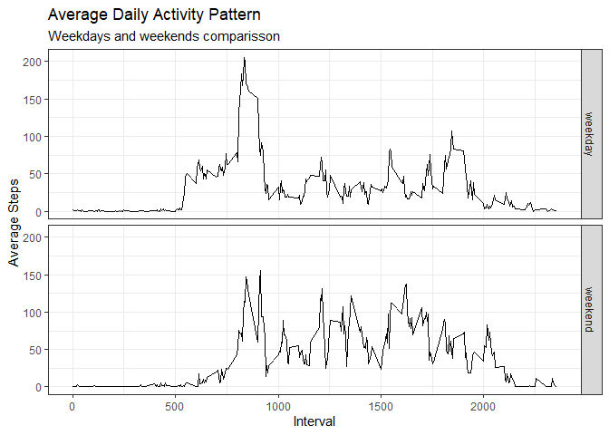

Loading libraries
-----------------

    library(dplyr)

    ## 
    ## Attaching package: 'dplyr'

    ## The following objects are masked from 'package:stats':
    ## 
    ##     filter, lag

    ## The following objects are masked from 'package:base':
    ## 
    ##     intersect, setdiff, setequal, union

    library(ggplot2)

Loading and preprocessing the data
----------------------------------

First we must load the data and process it for future work.

    dat <- read.csv("./activity.csv")
    dat <- mutate(dat, date = as.Date(date))
    str(dat)

    ## 'data.frame':    17568 obs. of  3 variables:
    ##  $ steps   : int  NA NA NA NA NA NA NA NA NA NA ...
    ##  $ date    : Date, format: "2012-10-01" "2012-10-01" ...
    ##  $ interval: int  0 5 10 15 20 25 30 35 40 45 ...

    summary(dat)

    ##      steps             date               interval     
    ##  Min.   :  0.00   Min.   :2012-10-01   Min.   :   0.0  
    ##  1st Qu.:  0.00   1st Qu.:2012-10-16   1st Qu.: 588.8  
    ##  Median :  0.00   Median :2012-10-31   Median :1177.5  
    ##  Mean   : 37.38   Mean   :2012-10-31   Mean   :1177.5  
    ##  3rd Qu.: 12.00   3rd Qu.:2012-11-15   3rd Qu.:1766.2  
    ##  Max.   :806.00   Max.   :2012-11-30   Max.   :2355.0  
    ##  NA's   :2304

As we can see, now, we have a data frame with the number of steps, the
date, and the interval.  
It looks like there are a bunch (2304) of NA’s in the steps variable.

What is mean total number of steps taken per day?
-------------------------------------------------

To do this we first group the data by the date varibale. Then we
summarize it by adding the total steps per day and asign the result to a
new data frame called total\_day.

    total_day <- group_by(dat, date) %>% summarize(total_steps = sum(steps))

Lets plot the histogram for the total number of steps per day.

    {ggplot(total_day, aes(total_steps)) +
            geom_histogram(bins = 25, alpha = 0.75, color = "black") +
            labs(title = "Total Number of Steps Per Day",
                 x = "Steps per day",
                 y = "Frequency") +
            theme_bw()}

    ## Warning: Removed 8 rows containing non-finite values (stat_bin).

We can calculate the mean and median of the total number of steps per
day.

    summary(total_day$total_steps)

    ##    Min. 1st Qu.  Median    Mean 3rd Qu.    Max.    NA's 
    ##      41    8841   10765   10766   13294   21194       8

As shown above, the mean number of total steps per day is 10766 and the
median are 10765. Those numbers are pretty close.

What is the average daily activity pattern?
-------------------------------------------

To do this, we first need to group the data by the interval. Then,
summarize it by avarageing the number of stpes across all days. Finally,
we can plot a time series of the daily activity pattern.

    average_int <- group_by(dat, interval) %>% summarize(avg_int = mean(steps, na.rm = T))
    {ggplot(average_int, aes(x = interval, y = avg_int)) +
            geom_line() + 
            labs(title = "Average Daily Activity Pattern",
                 x = "Interval",
                 y = "Average Steps") +
            theme_bw()}

The 5-min interval with the maximun average is interval 835!

    head(arrange(average_int, desc(avg_int)))

    ## # A tibble: 6 x 2
    ##   interval avg_int
    ##      <int>   <dbl>
    ## 1      835    206.
    ## 2      840    196.
    ## 3      850    183.
    ## 4      845    180.
    ## 5      830    177.
    ## 6      820    171.

Imputing missing values
-----------------------

As shown above, the total number of missing values is 2304. We can
double check it by calculating the summary of the steps.

    summary(dat$steps)

    ##    Min. 1st Qu.  Median    Mean 3rd Qu.    Max.    NA's 
    ##    0.00    0.00    0.00   37.38   12.00  806.00    2304

Our strategy to impute the missing values is to use the median value for
each interval. To do this, it is requiered to calculate the median steps
for each interval.

    med_int <- group_by(dat, interval) %>% summarize(median_int = median(steps, na.rm = T))
    head(med_int)

    ## # A tibble: 6 x 2
    ##   interval median_int
    ##      <int>      <int>
    ## 1        0          0
    ## 2        5          0
    ## 3       10          0
    ## 4       15          0
    ## 5       20          0
    ## 6       25          0

Now, it is time to impute the missing values and create a new data
frame.

    new_dat <- data.frame()
    for(i in 1:length(dat$interval)){
        if (is.na(dat[i,1])){
            new_dat[i,1] = med_int[match(dat[i,3], med_int$interval),2]
            new_dat[i,2] = dat[i,3]
            new_dat[i,3] = dat[i,2]
        } else {
            new_dat[i,1] = dat[i,1]
            new_dat[i,2] = dat[i,3]
            new_dat[i,3] = dat[i,2]
        }
    }
    names(new_dat) <- c("steps", "interval", "date")
    summary(new_dat$steps)

    ##    Min. 1st Qu.  Median    Mean 3rd Qu.    Max. 
    ##       0       0       0      33       8     806

To show the impact of imputing data, we can show the same histogram as
the one in the begining, but with our new data set.

    total_day_new <- group_by(new_dat, date) %>% summarize(total_steps = sum(steps))
    {ggplot(total_day_new, aes(total_steps)) +
            geom_histogram(bins = 25, alpha = 0.75, color = "black") +
            labs(title = "Total Number of Steps Per Day",
                 subtitle = "Data imputed using median of the interval",
                 x = "Steps per day",
                 y = "Frequency") +
            theme_bw()}

Also, we can compare the mean and median values of each data set.

    summary(dat$steps)

    ##    Min. 1st Qu.  Median    Mean 3rd Qu.    Max.    NA's 
    ##    0.00    0.00    0.00   37.38   12.00  806.00    2304

    summary(new_dat$steps)

    ##    Min. 1st Qu.  Median    Mean 3rd Qu.    Max. 
    ##       0       0       0      33       8     806

As show in the above comparisson, after imputing the data, the upper
side of the distribution decreasead.

Are there differences in activity patterns between weekdays and weekends?
-------------------------------------------------------------------------

To compare this, first, we need a new factor variable indicating if is
weekday or not.

    new_dat <- mutate(new_dat,
                      Day = weekdays(date, abbreviate = T))
    weekends <- c("Sat", "Sun")
    for(i in 1:length(new_dat$steps)){
        if (new_dat[i,4] %in% weekends){
            new_dat[i,4] = "weekend"
        } else {
            new_dat[i,4] = "weekday"
        }
    }
    new_dat <- mutate(new_dat, Day = as.factor(Day))
    summary(new_dat$Day)

    ## weekday weekend 
    ##   12960    4608

Now me can compare the pattern for weekdays and weekends using the
average number of steps per interval across all days.

    average_comp <- group_by(new_dat, interval, Day) %>% summarize(avg_int = mean(steps))
    {ggplot(average_comp, aes(x = interval, y = avg_int)) +
            geom_line() + 
            facet_grid(Day~.) +
            labs(title = "Average Daily Activity Pattern",
                 subtitle = "Weekdays and weekends comparisson",
                 x = "Interval",
                 y = "Average Steps") +
            theme_bw()}

